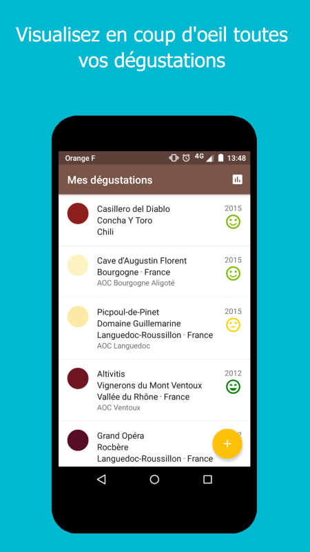
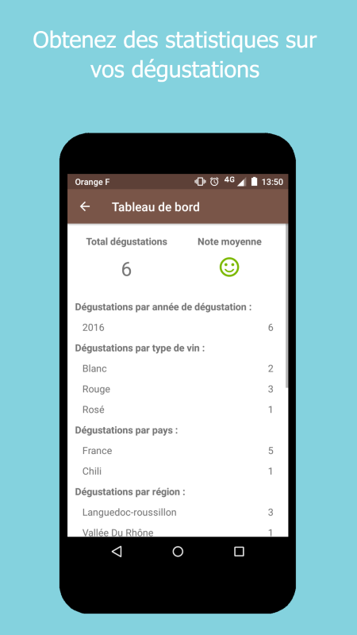
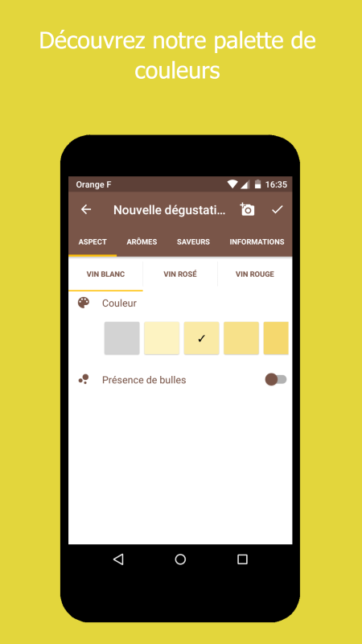
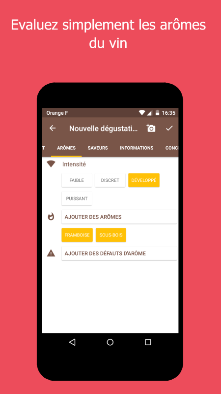
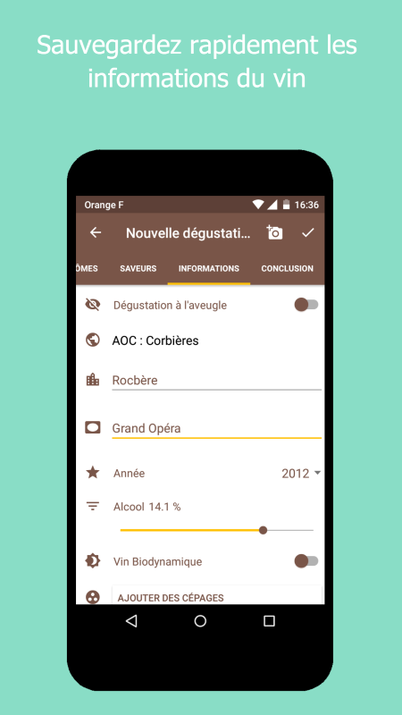
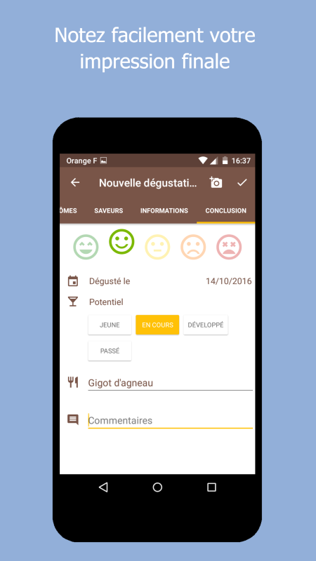
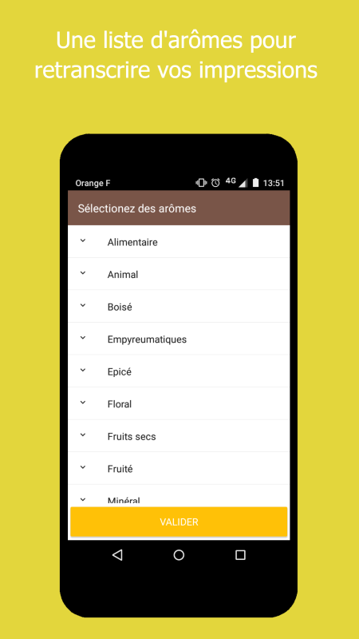
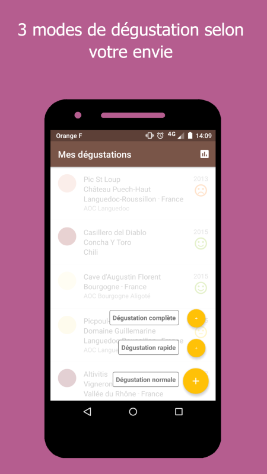

# Winenjoy

Winenjoy est une application pour Android qui permet de noter ses dégustations de vin.
L'application a été développé avec le framework Nativescript.

https://play.google.com/store/apps/details?id=com.winenjoy.app

Grâce à un design étudié, la prise de note se veut efficace et rapide sans vous détourner de l'essentiel : la dégustation.
Evaluez chaque étape de la dégustation d'un vin précisément et d'un simple geste.

VIN :
* Sélectionnez le type de vin dégusté : blanc, rosé ou rouge.
* Choisissez parmis notre liste de pays, de régions.
* Définissez l'AOC puis le millésime.
* Le vin dégusté est-il bio ou biodynamique ?
* Précisez les cépages utilisés parmis notre liste.

ASPECT :
* Définissez la couleur du vin grâce à notre palette de robes.
* Sélectionnez la limpidité, la brillance, les larmes mais aussi les bulles si le vin est pétillant.

ARÔMES :
* Nous vous offrons une large palette d'arômes pour retranscrire parfaitement vos sensations dans cette étape importante.
* Le vin est-il bouchonné ? Notez-le.

SAVEURS :
* Quelle est l'attaque du vin ? Est-il tannique ou acide ?
* Evaluez la longueur en bouche.

SYNTHÈSE :
* Notez votre sentiment suite à cette dégustation.
* Complétez par une photo de l'étiquette.

Pour chaque étape, il est possible de rajouter des commentaires propres à vous.

---

Pour tout problème, suggestion ou critique, contactez-nous :

* MAIL : winenjoy.app@gmail.com
* FACEBOOK : https://www.facebook.com/winenjoyapp
* TWITTER : https://twitter.com/WinenjoyApp
* SITE : http://winenjoy.strikingly.com/
